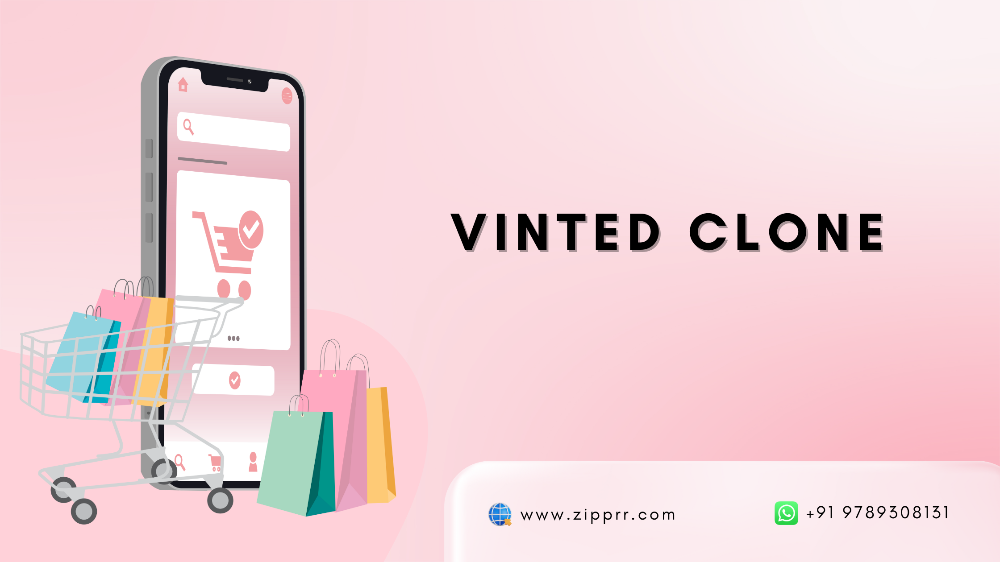

# Launch Your Resale Marketplace Using Vinted Clone
Vinted has grown into a well-known resale clothing marketplace where individuals buy and sell pre-owned fashion items with ease. From everyday apparel to premium secondhand pieces, it connects sellers and buyers who value affordability, sustainability, and style. The platform demonstrates how peer-to-peer resale has become a powerful segment within modern eCommerce.

But what if you want to build a Vinted-like resale marketplace tailored to a specific region, audience, or business model? Developing such a platform from the ground up can be complex and time-consuming. A <a href="https://zipprr.com/vinted-clone/">Vinted clone</a> solution provides the essential features needed to launch quickly, while allowing full customization to match your brand, monetization strategy, and growth goals.
## What Is Vinted Clone Software?
Vinted clone is a <a href="https://zipprr.com/vinted-clone/">ready-made resale marketplace solution</a> designed to help businesses launch a secondhand fashion platform without building everything from scratch. It is inspired by the core functionality of popular resale clothing platforms and can be fully customized to match your target market, branding, and business requirements.

The solution operates as a <a href="https://zipprr.com/vinted-clone/">peer-to-peer, multi-seller marketplace</a> where individuals can list pre-owned clothing, manage their profiles, and complete secure transactions. Buyers can browse listings, communicate with sellers, make purchases, and leave feedback using built-in features such as user accounts, integrated payment systems, order management, and messaging tools.
## Key Highlights:
**Transparent pricing with no hidden fees** – Clear cost structure with no surprise charges or recurring platform fees

**Highly scalable** – Built to grow smoothly as users, listings, and transactions increase

**Customizable** – Easily tailor features, design, and workflows to your resale business

**Onboard unlimited sellers** – Allow any number of sellers to join and list items without restrictions

**Lifetime license** – One-time purchase with lifetime usage rights and no expiration

**One-time payment model** – Pay once and own the platform without monthly or yearly fees

**Full source code access** – Complete control to modify, extend, and scale the platform freely

**Cross-platform availability on Android and iOS** – Native mobile apps for both Android and iOS users

**Targeted reselling features** – Purpose-built tools for secondhand fashion and peer-to-peer resale

**Lightning-fast performance** – Optimized architecture for quick load times and smooth navigation

**Advanced security with 2FA** – Extra account protection using two-factor authentication

**Flexible monetization** – Support for commissions, subscriptions, ads, or custom revenue models
## Why Choose Vinted Clone as the Full-Featured Marketplace Solution in 2026?
**Lightning-Fast Launch**

A Vinted-style marketplace solution lets businesses launch quickly using pre-built core features. Instead of months of development, you can go live in weeks, test your market faster, and start acquiring users while competitors are still building.

**Cost-Effectiveness**

Building a <a href="https://zipprr.com/vinted-clone/">resale marketplace</a> from scratch is expensive and risky. A ready-made Vinted clone significantly reduces development, design, and infrastructure costs, allowing startups and enterprises to invest more in marketing, growth, and user acquisition.

**Proven Business Model**

This solution is based on a marketplace model already validated by successful resale platforms. It supports peer-to-peer transactions, commissions, premium listings, and subscriptions, giving businesses multiple monetization options with lower risk and predictable scalability.

**Mobile Responsiveness**

The platform is fully responsive across iOS, Android, and web devices. Users can easily list, browse, chat, and purchase on any screen size, delivering a smooth experience that matches modern consumer expectations and increases engagement and conversions.

**SEO Optimization**

Built-in SEO-friendly architecture helps your marketplace rank faster on search engines and AI-driven search platforms. Clean URLs, optimized metadata, and scalable content structures make it easier to attract organic traffic from buyers and sellers.

**Enable AI**

AI-powered features such as smart search, personalized recommendations, fraud detection, and automated moderation enhance user experience and operational efficiency. This future-ready approach helps your marketplace stay competitive as AI-driven commerce becomes the industry standard.

**Build a Strong Brand**

A <a href="https://zipprr.com/vinted-clone/">Vinted clone app</a> can be fully customized to reflect your brand identity, target audience, and niche. From UI design to domain ownership, you maintain full control, helping you build trust, recognition, and long-term customer loyalty.

**Excellent Customer Support**

Professional technical support ensures smooth onboarding, fast issue resolution, and continuous platform stability. Reliable support reduces downtime, improves seller and buyer satisfaction, and allows your team to focus on scaling the business confidently.

**Crush the Competition**

Launching with a feature-rich marketplace gives you a competitive advantage from day one. Advanced tools, faster updates, and scalable infrastructure help you outperform new entrants and adapt quickly to changing market demands.

**Data Analytics & Insights**

Integrated analytics provide real-time insights into user behavior, transactions, and growth trends. These data-driven insights help you optimize pricing, improve user experience, refine marketing strategies, and make smarter business decisions.

## Conclusion
Launching a resale fashion marketplace in 2026 is a smart move, and a  <a href="https://zipprr.com/vinted-clone/">Zipprr Vinted clone</a> gives you the speed, flexibility, and scalability needed to succeed. With a proven marketplace model, modern features, AI-ready capabilities, and full brand customization, Zipprr helps you enter the secondhand clothing market with confidence. 

Instead of building from scratch, you can focus on growth, user acquisition, and long-term profitability. Whether you’re a startup or an established business, <a href="https://zipprr.com/vinted-clone/">Zipprr’s Vinted-style solution</a> empowers you to build a trusted, competitive resale platform.

Request a live demo today and start building your marketplace with Zipprr - <a href="https://zipprr.com/vinted-clone/#demo">https://zipprr.com/vinted-clone/#demo</a>

​​Contact us,

Call: +91 9789308131

Mail ID- support@zipprr.com
